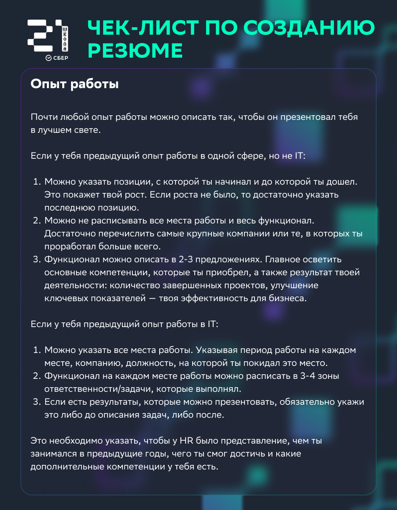
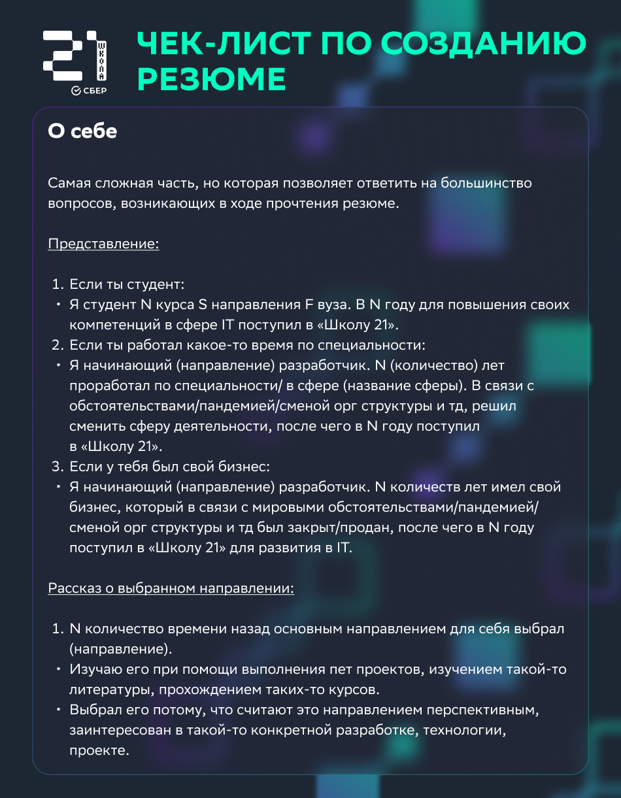
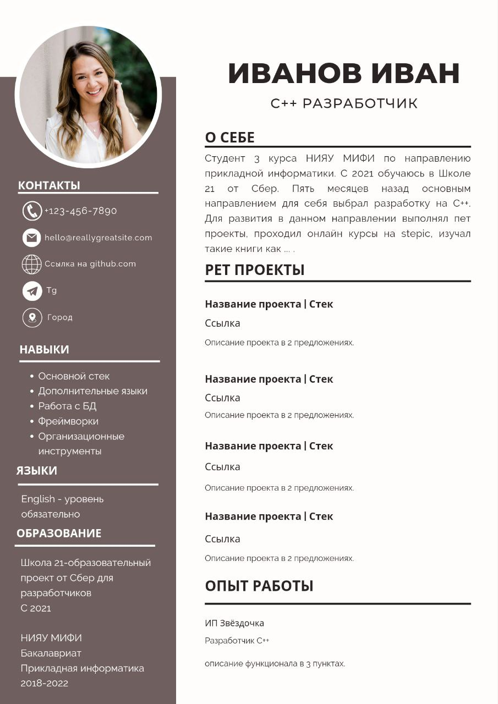

### Гайды по оформлению репозитория на github

- [Хабр](https://habr.com/ru/post/649363/)
- [Tproger](https://tproger.ru/articles/how-to-prepare-your-github-profile/)

### Инструкция по оформлению резюме для стажировки в Сбер
Теперь для отклика на вакансии от Сбер необходимо иметь резюме выполненное по специальной структуре. Могут быть разные шрифты и цвета, но блоки должны быть именно эти и располагаться именно в этих местах. Единственное, что может отсутствовать это блоки языки и опыт работы. Данный пример-шаблон, был создан на [Canva](https://www.canva.com/templates/?query=cv). На данном ресурсе вы можете найти множество шаблонов под любой вкус, что позволит вам проявить свою индивидуальность уже на первом этапе отбора.
По ссылке вы найдете шаблон резюме в [Figma](https://www.figma.com/file/dcpF8Vp2eMqITbWoKfWmj2/%D0%A8%D0%B0%D0%B1%D0%BB%D0%BE%D0%BD-%D1%80%D0%B5%D0%B7%D1%8E%D0%BC%D0%B5?type=design&node-id=0-1), которым вы также можете
воспользоваться. Вы можете скопировать себе данный шаблон и отредактировать под себя.
P.S. VPN для Canva - Browsec VPN, UltraSurf Security, Privacy & Unblock VPN, Planet VPN.

Пример того, что должно получиться

