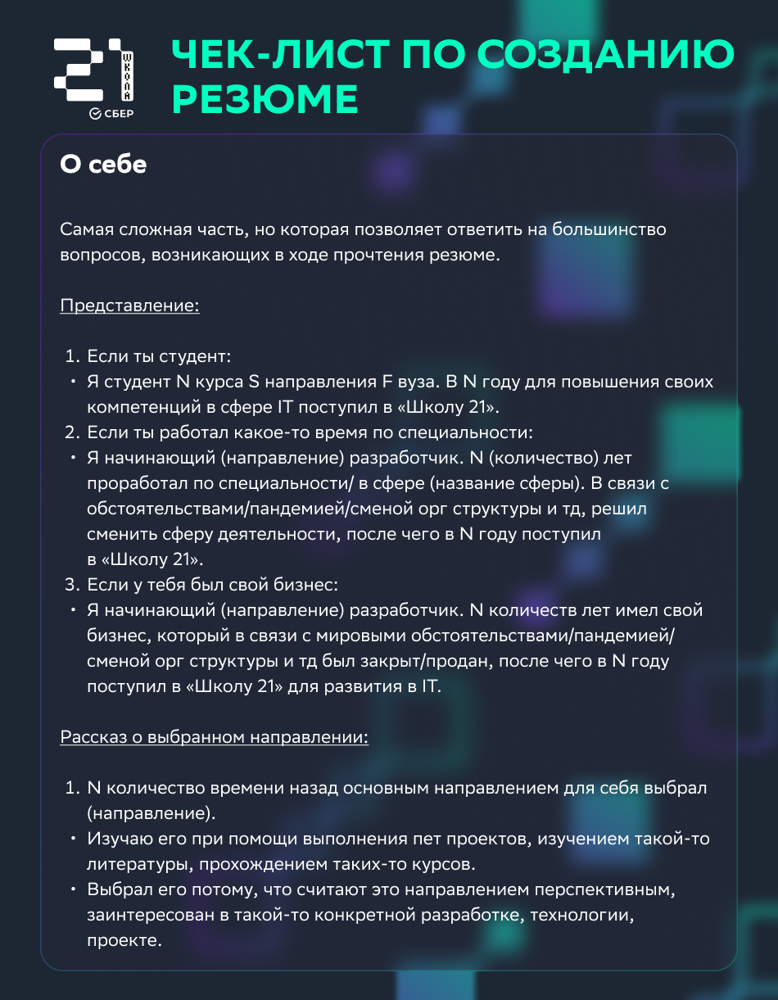

### Гайды по оформлению репозитория на github

- [Хабр](https://habr.com/ru/post/649363/)
- [Tproger](https://tproger.ru/articles/how-to-prepare-your-github-profile/)

### Инструкция по оформлению резюме для стажировки в Сбер

Пример того, что должно получиться

[Ссылка на фигму](https://www.figma.com/file/dcpF8Vp2eMqITbWoKfWmj2/%D0%A8%D0%B0%D0%B1%D0%BB%D0%BE%D0%BD-%D1%80%D0%B5%D0%B7%D1%8E%D0%BC%D0%B5?type=design&node-id=0-1)
